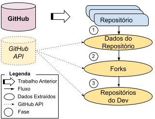

# Pacote de Replicação - Extração de Forks de Repositórios de Software

Aqui você encontra os detalhes de implementação do nosso trabalho "Mineração de Repositórios de Software para Internet das Coisas e Robótica (IoRT): Análise Inicial dos Forks".
Nossa abordagem consiste em 3 etapas principais, conforme mostrado na figura abaixo.



O trabalho tem como base uma lista de repositórios de software disponíveis [nessa](https://github.com/IntelAgir-Research-Group/sbcars2021-replication-package-mining-iot) outra publicação anterior.


## Banco de Dados (Dados Extraídos)
Este estudo foi realizado por membros do Grupo de Pesquisa Intel Agir, com o apoio da Fundação Araucária, com bolsa PIBIC, sob a orientação do professor Michel Albonico.

- [Michel Albonico](https://michelalbonico.github.io) (Professor da Universidade Tecnológica Federal do Paraná)
- [Alexandre Corneau](https://github.com/ALEXANDRECORNEAU) (Bolsista PIBIC da Universidade Tecnológica Federal do Paraná)

## Construindo o conjunto de dados
O procedimento de mineração dos repositórios de software foi automatizado utilizando scripts de Python e a API REST do GitHub. Neste repositório, disponibilizamos os códigos de Python utilizados. 

Nossos scripts são organizados da seguinte forma:

````
./--- analise/                  Pasta com os scripts utilizados para a análise estatística e qualitativa dos dados minerados.
./--- banco/                    Pasta que contém o bando com todas as extrações. 
./--- buscador/                 Pasta aonde fica o código de mineração dos repositórios do GitHub.
````

Cada pasta contém sua própria documentação.
